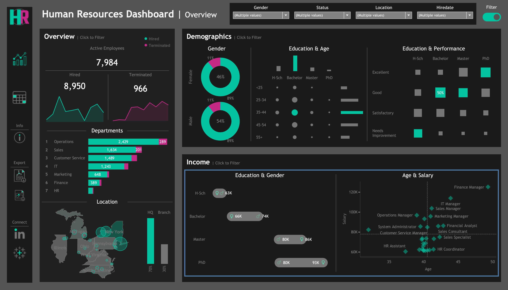
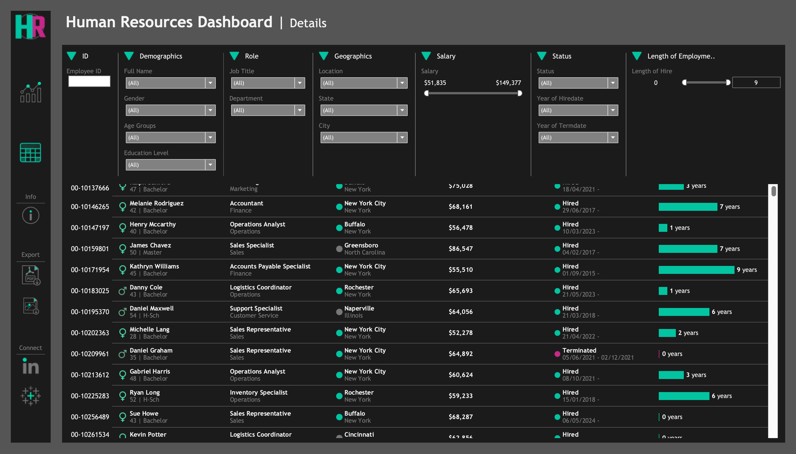

# HR Dashboard using Tableau 📊

This repository contains the HR Dashboard project created using Tableau. The dataset used is generated with the help of ChatGPT and the Python Faker library, simulating typical employee information found in HR systems.

## Project Overview

### Summary View
The Summary View is divided into three main sections:
- **Overview**: Snapshot of overall HR metrics, including total employees, hiring/termination trends, department breakdown, HQ vs. branches comparison, and location distribution.
- **Demographics**: Insights into workforce composition, including gender ratio, age groups, education levels, and correlation between education and performance ratings.
- **Income Analysis**: Salary-related metrics, including salary comparisons across education levels and age-salary correlation by department.

### Employee Records View
A comprehensive list of all employees with filtering options based on available columns.

## Screenshots 📷

### HR Dashboard | Overview

### HR Dashboard | Details

## Tableau Public Link
View the dashboard on [Tableau Public](https://public.tableau.com/app/profile/ajmeera.roopchand/viz/HRDashboard_17200173732460/HRSummary)

